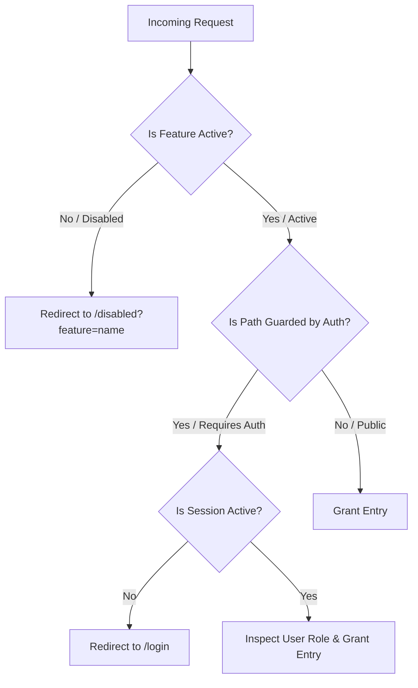

# Shri Sameya Village E-Commerce — Feature Flags Report

This document outlines the **Environment-based Feature Flagging System** implemented across the storefront, customer portal, and administrator operations.

---

## 🛠️ Configuration & Management

All system capabilities can be turned **ON** or **OFF** globally by editing environment variables inside the `.env` file in the root directory of your project:

```bash
# Path: /Users/tm/Oil-ecommerce/.env
NEXT_PUBLIC_ENABLE_CART="true"
NEXT_PUBLIC_ENABLE_TRACK_ORDER="true"
NEXT_PUBLIC_ENABLE_FEEDBACK="true"

NEXT_PUBLIC_ENABLE_ADMIN_PRODUCTS="true"
NEXT_PUBLIC_ENABLE_ADMIN_USERS="true"
NEXT_PUBLIC_ENABLE_ADMIN_ORDERS="true"
```

> [!NOTE]
> Changes to environment variables require a system server hot-reload (restart the development process via `npm run dev`) to apply.

---

## 📊 Catalog of Platform Toggles

| Feature Flag Variable | Capabilities Controlled | User Experience Impact (When `"false"`) |
| :--- | :--- | :--- |
| **`NEXT_PUBLIC_ENABLE_CART`** | Cart operations, product additions, localStorage cart persistency, Checkout forms, Cash on Delivery payments. | Hides Cart icons in navbar. Disables Add-to-Cart buttons in showcase. Blocks direct access to `/cart` and `/checkout` (redirects to customized offline banner). |
| **`NEXT_PUBLIC_ENABLE_TRACK_ORDER`** | Customer order listings, sidebar profile menus, individual tracking details, progression badges, historical summaries. | Hides "My Orders" buttons in navigation. Redirects all direct hits to `/orders` or `/orders/[id]` to a styled Premium "Offline" notification. |
| **`NEXT_PUBLIC_ENABLE_FEEDBACK`** | verified customer star ratings, comments, catalog review listing sheets, purchase verification filters. | Hides review lists in product description tabs. Hides post-purchase feedback ratings form inside verified customer order pages. |
| **`NEXT_PUBLIC_ENABLE_ADMIN_PRODUCTS`** | Admin catalog CRUD, publishing new products, editing prices/stocks/categories, uploading image URLs, saving custom descriptions. | Removes "Global Catalog" links in the Ops Sidebar. Blocks direct dashboard access to `/admin/products` and editing subpages. |
| **`NEXT_PUBLIC_ENABLE_ADMIN_USERS`** | Admin platform directory, role escalations (promoting user to SELLER), active state account blocks. | Removes "User Management" links in the Ops Sidebar. Blocks direct access to `/admin/users` panel. |
| **`NEXT_PUBLIC_ENABLE_ADMIN_ORDERS`** | Admin platform order log, system transaction audits, logistics state updates (PENDING to PAID/SHIPPED/DELIVERED). | Removes "All Orders" links in the Ops Sidebar. Blocks direct access to `/admin/orders` panel. |

---

## 🔒 Route Guarding Architecture

The system uses a unified, secure Next.js root-level router middleware **`middleware.ts`** to inspect incoming edge network traffic:



### Premium UI Gating (`<FeatureGate>`)
For minor layout integrations (such as action buttons or optional catalog headers), the storefront implements a client-side gating component:

```typescript
import { FeatureGate } from "@/components/shop/FeatureGate";

// Example Usage in Product Page
<FeatureGate feature="feedback" showDisabledBanner={false}>
  <ReviewsTab productId={id} />
</FeatureGate>
```
If a feature is deactivated, the gate dynamically collapses to `null` or displays a premium, custom HSL alert banner depending on the parameters.
